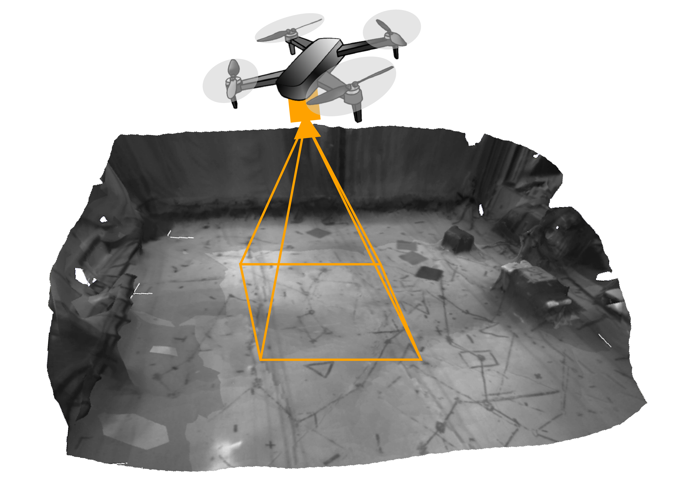

# `mav_sim`: a Simple, Minimal Micro Aerial Vehicles Simulator for Sensorimotor Policy Learning


`mav_sim` is a simple, lightweight simulator for Micro Aerial Vehicles (quadrotors and any generic multirotor), based on Python/Pybullet, ideal to be used as simulation engine when wrapped around an Open AI gym interface for motor/sensorimotor policy learning. 
`mav_sim` simulates the 6-degrees of freedom rigid body dynamics of an UAV with an onboard camera that generates syntetic images of the MIT Highbay, an indoor flight space. 


This is the simulation framework associated with the following publication: 

A. Tagliabue, J. P. How, "Output Feedback Tube MPC-Guided Data Augmentation for Efficient, Robust Sensorimotor Policy Learning", IEEE/RSJ International Conference on Intelligent Robots and Systems (IROS), 2022. [Arxiv PDF](https://arxiv.org/pdf/2210.10127.pdf).

Earlier/modified versions of this work were also used for the following publications: 

A. Tagliabue, D.-K. Kim, M. Everett and J. P. How, "Demonstration-Efficient Guided Policy Search via Imitation of Robust Tube MPC",  International Conference on Robotics and Automation (ICRA), 2022. [Arxiv PDF](https://arxiv.org/pdf/2109.09910.pdf), [Video](https://www.youtube.com/watch?v=28zQFktJIqg).

## Citation
If you find this work useful for your research, please consider citing: 

```bibtex
@INPROCEEDINGS{tagliabue2022output,
  author={Tagliabue, Andrea and How, Jonathan P.},
  booktitle={2022 International Conference on Intelligent Robots and Systems (IROS)}, 
  title={Output Feedback Tube MPC-Guided Data Augmentation for Efficient, Robust Sensorimotor Policy Learning}, 
  year={2022},
  volume={},
  number={},
  pages={},
  doi={}}
```

or

```bibtex
@INPROCEEDINGS{tagliabue2022demonstration,
  author={Tagliabue, Andrea and Kim, Dong-Ki and Everett, Michael and How, Jonathan P.},
  booktitle={2022 International Conference on Robotics and Automation (ICRA)}, 
  title={Demonstration-Efficient Guided Policy Search via Imitation of Robust Tube MPC}, 
  year={2022},
  volume={},
  number={},
  pages={462-468},
  doi={10.1109/ICRA46639.2022.9812122}}
```

## Credits
`mav_sim` is inspired by the excellent [Gym Pybullet Drones](https://github.com/utiasDSL/gym-pybullet-drones). 
`mav_sim` focus is on providing a simple, minimal, single agent simulation framework that can be easily adapted and interfaced with your own Python pipelines (Gym, ROS, ...), with a focus on accurate MAV dynamics, easily configurable parameters (via [yacs](https://github.com/rbgirshick/yacs)), and the generation of photorelistic images from a 3D mesh obtained from real images. 
Our framework additionally includes a state-of-the-art geometric attitude controller, based on [this work](https://ieeexplore.ieee.org/stamp/stamp.jsp?tp=&arnumber=5717652):

T. Lee, M. Leok and N. H. McClamroch, "Geometric tracking control of a quadrotor UAV on SE(3)," 49th IEEE Conference on Decision and Control (CDC), 2010, pp. 5420-5425, doi: 10.1109/CDC.2010.5717652.

## Installation: 
```sh
pip install -e mav_sim
```

## Example usage: 
```python
import numpy as np
from mav_sim.simulator import MavSim
from mav_sim.config import cfg # exposes all the loaded parameters
mav_sim = MavSim("HX14.yaml")  # can replace "HX14.yaml" with your own custom UAV & simulation parameters.

# Define setpoints for attitude controller
B_thrust = np.array([0.0, 0.0, cfg.rbt.mass*cfg.sim.gravity]) # Dummy, computed by high-level controller
B_rpy_ref = np.zeros(3)   # Dummy, computed by high-level controller
B_omega_ref = np.zeros(3) # Dummy, computed by high-level controller

# Step attitude-controlled simualtion: 
N_steps = 100
for i in range(N_steps):
  obs = mav_sim.step_attitude_control_and_dynamics(B_thrust, B_rpy_ref, B_omega_ref) 
  # obs contains pos, vel, roll, pitch in world-aligned frame

```
for a more complete example, please see `mav_sim_example.ipynb`. 

## Useful resources: 
- Pybullet [quickstart guide.](https://docs.google.com/document/d/10sXEhzFRSnvFcl3XxNGhnD4N2SedqwdAvK3dsihxVUA/edit#heading=h.2ye70wns7io3).
- Tutorial on [how to configure a camera in pybullet.](https://towardsdatascience.com/simulate-images-for-ml-in-pybullet-the-quick-easy-way-859035b2c9dd)

## TODOs:
- [x] Add examples with simple position control feedback.
- [x] Add examples to visualize images. 
- [ ] Document in readme input output of controllers. 
- [ ] Add examples of gym interface. 

## Acknowledgement
This work was funded by the Air Force Office of Scientific Research MURI FA9550-19-1-0386. 